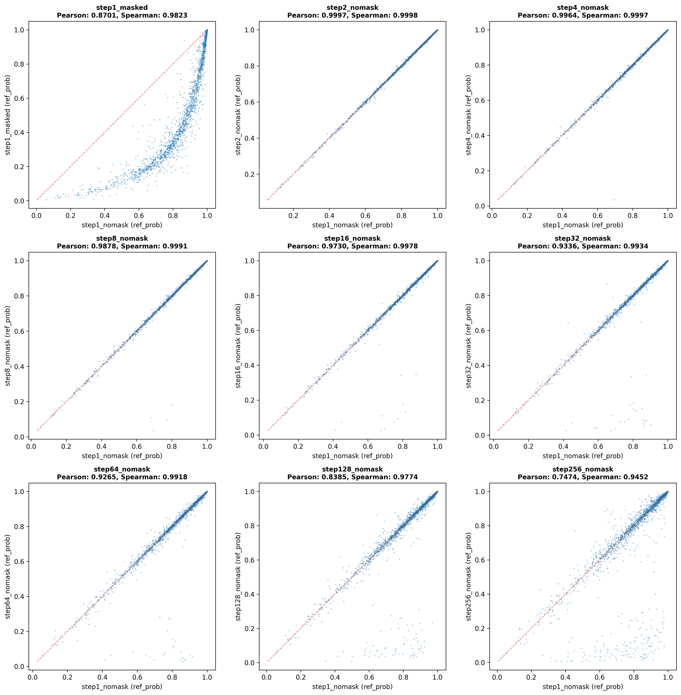

# Performance Tuning for Genome-Wide Scoring

When using the `zero_shot_score.py` script in BED input mode, you can significantly improve performance by adjusting the `-step-size` and `-use-masking` parameters. This document explains the trade-offs and provides recommendations for tuning these parameters.

## The Trade-off: Speed vs. Accuracy

The core of genome-wide scoring involves sliding a window across the genome and calculating scores at each position.
- **Accuracy (Baseline Method):** The most accurate method is to score every single nucleotide individually. This is achieved by using `-step-size 1` and masking the token being scored (`-use-masking`). In this mode, the model's context window is perfectly centered on each position being scored. We consider this the baseline for comparison.
- **Speed:** To increase speed, we can process nucleotides in blocks instead of individually. A larger `-step-size` groups bases together. For example, `-step-size 4` processes the genome in blocks of 4. For each block, the model is run only **once**, with the context window centered on the middle of the block. The scores for all 4 positions are then extracted from this single model output. This reduces the number of model inferences by a factor of 4, leading to a ~4x theoretical speedup. The resulting scores are an approximation because the context is not perfectly centered for each individual base, but the high correlation shows it is a very effective strategy.

## Performance Analysis

We analyzed the trade-off by comparing the scores generated by different step sizes (without masking) to the scores from the baseline method.

The table below shows the **theoretical speedup** and the **Pearson correlation** of the output scores with the baseline scores. A higher correlation means the approximate scores are more similar to the baseline scores.

| Step Size | Theoretical Speedup | Pearson Correlation (vs. Baseline) |
|:---:|:---:|:---:|
| 1   | 1x  | 0.9832 |
| 2   | 2x  | 0.9831 |
| 4   | 4x  | 0.9824 |
| 8   | 8x  | 0.9808 |
| 16  | 16x | 0.9776 |
| 32  | 32x | 0.9695 |
| 64  | 64x | 0.9667 |
| 128 | 128x| 0.9442 |
| 256 | 256x| 0.9051 |

*Note: The theoretical speedup is approximately equal to the step size. Real-world speedup will be slightly less due to model loading and I/O overhead, but it approaches this theoretical limit for large input regions.*

The scatter plot below visually compares the scores from the baseline (`step-size=1` with masking) and the fastest non-masked method (`step-size=1` without masking), showing a very high degree of correlation.



## Recommendations

1.  **High-Fidelity Scoring:** For the most accurate and fine-grained results, use the baseline settings:
    ```bash
    python src/zero_shot_score.py -input-bed <regions.bed> ... -step-size 1 -use-masking
    ```

2.  **Balanced Speed and Accuracy:** For a good compromise, a step size of **4** or **8** without masking is recommended. This provides a **4x-8x theoretical speedup** while maintaining a score correlation **above 0.98**.
    ```bash
    python src/zero_shot_score.py -input-bed <regions.bed> ... -step-size 8
    ```

3.  **Running on Limited Compute:** If you are working with limited computational resources, you may want to use a much larger step size. A good rule of thumb is to not exceed half the context window size. For the default context window of 512, the recommended maximum is:
    *   **Max Recommended `step-size` = 256**

    This provides a very fast, though more approximate, scan of large genomic regions.
